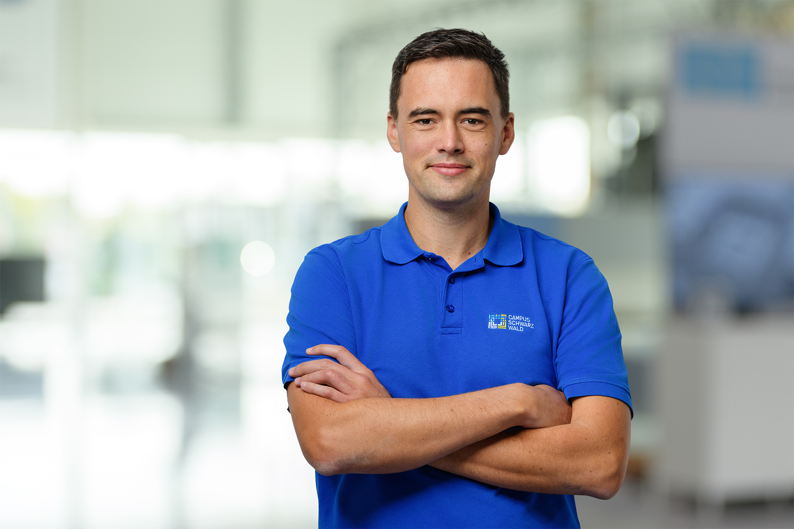

# Florian Handke vita

## English Version
**Florian Handke**

_Head of Industrial Security_

Florian Handke is the Head of Industrial Security at Campus Schwarzwald, a cluster of companies in the mechanical engineering and manufacturing industries. Holding a Master's degree (M.Sc.) in Mechanical Engineering with a specialization in Production Engineering, he is responsible for ensuring the security of industrial machinery and components. His expertise focuses on Public Key Infrastructure (PKI), digital identities, and their applications in industrial environments.

## German Version
**Florian Handke**

_Leiter Industrial Security_

Florian Handke ist Leiter des Bereichs Industrial Security am Campus Schwarzwald, einem Cluster von Unternehmen des Maschinenbaus und der Fertigungsindustrie. Der studierte Maschinenbauingenieur (M.Sc.) mit der Vertiefung Produktionstechnik ist verantwortlich für die Sicherheit von Industriemaschinen und -komponenten. Sein Schwerpunkt liegt auf Public Key Infrastructure (PKI), digitalen Identitäten und deren Anwendungen im industriellen Umfeld.

## Contact
**Address**:
Campus Schwarzwald,
Herzog-Eberhard-Straße 56,
72250 Freudenstadt

**Phone**:  +49 151 553 603 39

**Mail**: florian.handke@campus-schwarzwald.de

**LinkedIn**: https://www.linkedin.com/in/florian-handke/

**Pictures**:

